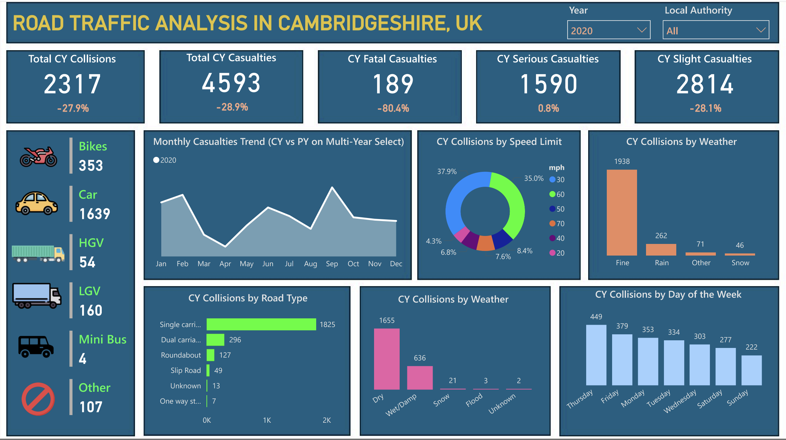
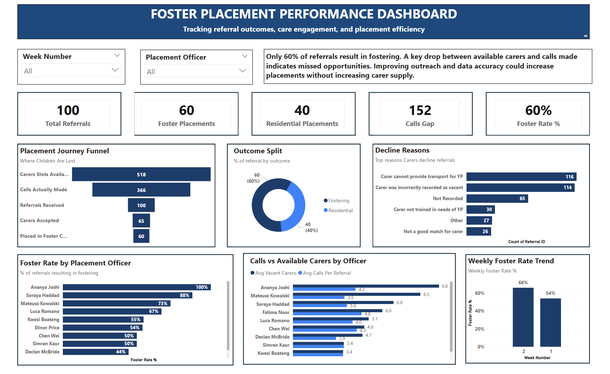
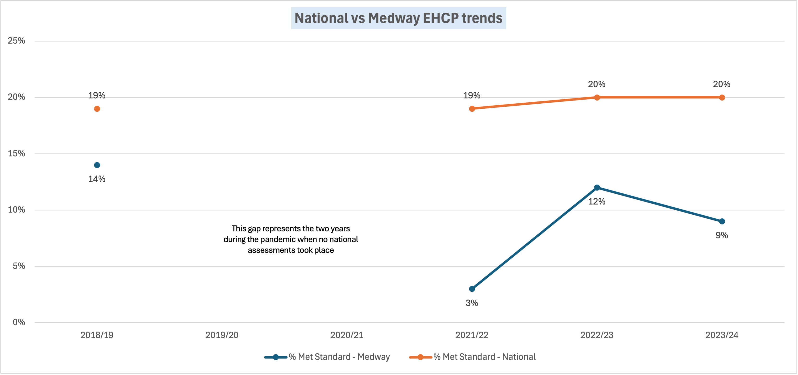
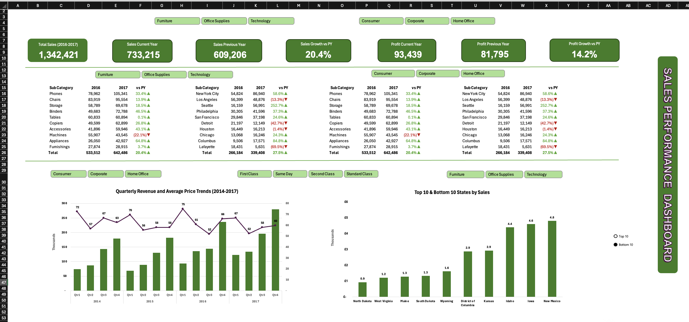
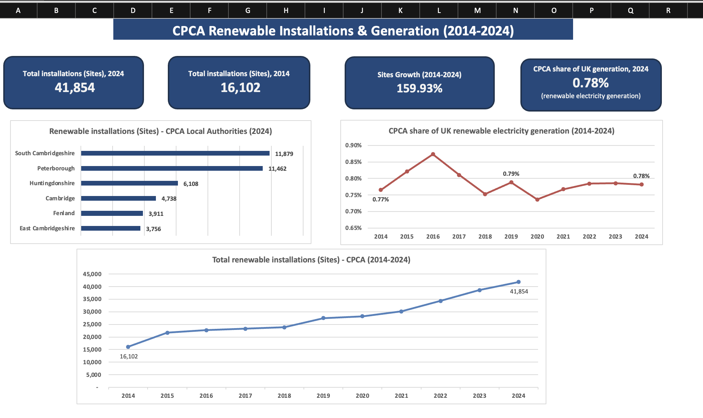
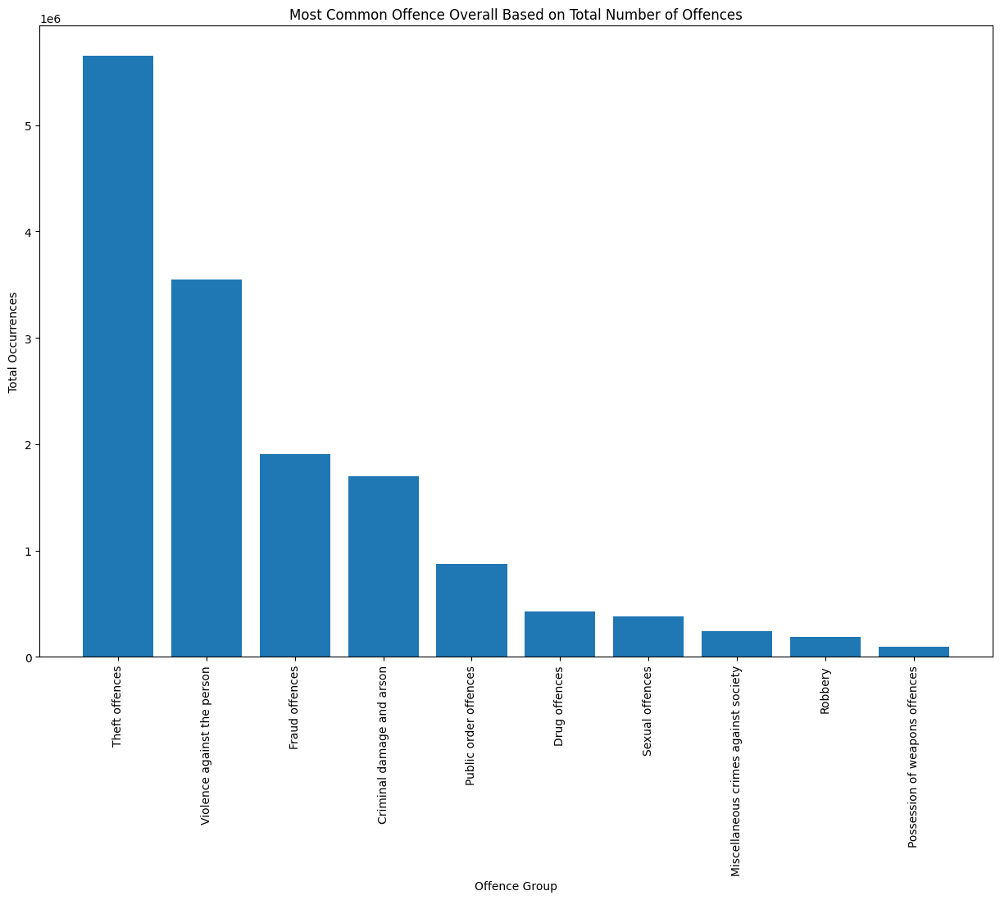

---
---

[About](index.html) | [Featured Projects](projects.html) | [GitHub](https://github.com/ismailolatunji) | [LinkedIn](https://linkedin.com/in/ismailolatunji)

---

## **Road Traffic Collision Severity Modelling**

**Situation:**  
Assess severity risk drivers across 22,000+ UK road collision records to understand which factors most influence high-severity outcomes.

**What I Did:**
- Built and compared five machine learning models to evaluate predictor influence
- Applied class-balancing techniques to improve model reliability
- Developed an interactive Power BI dashboard illustrating key risk factors and geographic patterns

**Key Insight:**
- Random Forest achieved 97 percent classification accuracy
- Identified consistent high-impact severity drivers and geographic concentration zones

**Why It Matters:**  
Demonstrates how structured modelling and visualisation can support targeted intervention prioritisation and evidence-based decision-making.

**Methods:** ML model comparison, risk factor analysis, executive dashboarding  
**Tools:** Python (Scikit Learn), Power BI  

[View Repository](https://github.com/ismailolatunji/Road-Traffic-Collision-Analysis-in-Cambridgeshire-UK)

---

<!--
## **Foster Placement Performance Dashboard**

**Situation:**

The Head of Service for a fostering organisation wanted to increase the number of children
placed in foster care when a referral comes in. The working assumption was a national
carer shortage. The data told a different story.

**What I Did:**

- Tracked every step from referral to placement to find where children were being lost
- Built performance metrics for foster rate, missed calls, and officer-level outcomes
- Analysed why carers were declining and how officers were using available resources

**Key Insight:**

- 230 of 313 declines came from two fixable causes: transport and incorrect vacancy data
- A 152-call gap between available carers and calls made showed the problem was process, not supply

**Why It Matters:**
Shows how data can reframe a perceived resourcing problem as a process problem, giving
leadership clear and immediate actions rather than waiting on long-term carer recruitment.

**Methods:** Funnel analysis, officer benchmarking, decline reason analysis
**Tools:** Power BI, DAX

[View Repository](https://github.com/ismailolatunji/foster-placement-dashboard)
---
-->

## **Education Attainment Gap Analysis (EHCP)**

**Situation:**  
Evaluate six years of EHCP phonics attainment data to benchmark local performance against national averages and assess structural risk.

**What I Did:**
- Structured year-on-year benchmarking across multiple academic cohorts
- Quantified attainment gaps relative to national performance
- Produced board-style analytical reporting for performance monitoring

**Key Insight:**
- Identified sustained 11 percent attainment gap relative to benchmark
- Highlighted data-quality inconsistencies impacting interpretation

**Why It Matters:**  
Shows how performance benchmarking and structured analysis can inform targeted improvement strategy and accountability monitoring.

**Methods:** Cohort benchmarking, gap analysis, performance reporting  
**Tools:** Excel, Power Query  

[View Repository](https://github.com/ismailolatunji/EHCP-phonics-attainment-gap-analysis-medway)

---

## **Executive Sales Performance Dashboard**

**Situation:**  
Improve executive visibility into revenue, product and customer performance while reducing manual reporting dependency.

**What I Did:**
- Automated reporting workflows using Power Query
- Designed structured KPI views across product and customer segments
- Consolidated reporting into a unified executive dashboard

**Key Insight:**
- Reduced reporting cycle time by 40 percent
- Enabled cross-functional teams to access performance data autonomously

**Why It Matters:**  
Illustrates how structured KPI architecture improves decision speed, performance visibility and operational efficiency.

**Methods:** KPI design, reporting automation, dashboard architecture  
**Tools:** Excel, Power Query, VBA  

[View Repository](https://github.com/ismailolatunji/Interactive-Excel-Dashboard-In-Depth-Sales-Performance-Analysis)

---

## **Renewable Installations and Generation Benchmark (CPCA, 2014–2024)**

**Situation:**  
Assess regional renewable installation growth and generation contribution relative to UK national performance over a ten-year period.

**What I Did:**
- Analysed installation and generation trends from 2014 to 2024
- Benchmarked regional contribution against national output
- Designed executive-style monitoring dashboard for structured performance tracking

**Key Insight:**
- Quantified regional growth trajectory and national share contribution
- Identified areas for deeper capacity and segmentation analysis

**Why It Matters:**  
Demonstrates how benchmarking frameworks can support long-term strategic monitoring and performance evaluation.

**Methods:** Trend analysis, benchmarking framework design  
**Tools:** Excel  

[View Repository](https://github.com/ismailolatunji/cpca-renewable-energy-installations-generation-analysis)

---

## **UK Crime Pattern Analysis Using PySpark**

**Situation:**  
Analyse multi-year UK police-recorded crime data to identify concentration patterns and trend shifts across geographic areas.

**What I Did:**
- Processed large-scale datasets using Apache Spark for scalable analysis
- Identified hotspot concentrations and evolving crime-type trends
- Structured findings into summarised insight outputs

**Key Insight:**
- Revealed consistent geographic concentration clusters
- Identified long-term pattern shifts across crime categories

**Why It Matters:**  
Demonstrates ability to work with distributed data processing frameworks and translate large-scale analysis into structured insight.

**Methods:** Distributed data processing, hotspot analysis  
**Tools:** PySpark, Python  

[View Repository](https://github.com/ismailolatunji/Crime-Analysis-Using-PySpark-and-Python)

---
<!--
## In Development

### Subscription Revenue Intelligence Framework

Designing an end-to-end KPI architecture for a subscription SaaS business including revenue modelling, churn and retention cohort analysis, metric definition logic and executive performance reporting.

This project will demonstrate structured measurement design aligned to commercial performance drivers.
---
-->

## Contact:
📧 [Email](mailto:olatunjiomotayoh@yahoo.com) · 💼 [LinkedIn](https://linkedin.com/in/ismailolatunji)
